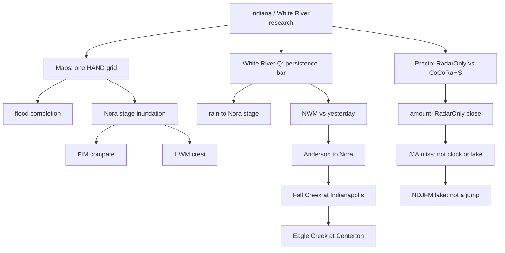

# Indiana / White River research

These trees are research. Each one asks one question, locks a split, and stops.

This page is the index. Repos and gists below point here. Gist copy: https://gist.github.com/martialsystems/66b896b0a4a0b8cba2b478aef64312f3

## How they relate

```text
Indiana / White River research
│
├── Maps
│   gist: https://gist.github.com/martialsystems/16584e78d079666f7e8994b4cc6158be
│   One 30 m HAND grid on the Upper White (HUC-8 05120201) and the Nora window.
│   ├── indiana_flood_completion      P(sfha | hydro) from terrain and distance-to-water
│   ├── white_river_stage_inundation  wet at 11.00 ft and 21.18 ft on that grid
│   ├── white_river_fim_compare       HAND bathtub vs USGS SIR 2011-5138 on the same window
│   └── white_river_hwm_crest         official HWMs vs the crest wet mask
│
├── White River Q
│   gist: https://gist.github.com/martialsystems/1104e5e47b8a04006ec694d289d43639
│   Same four gages, upstream to downstream. Persistence is the bar.
│   ├── white_river_rain_stage        Stage IV rain to Nora stage (yesterday wins)
│   ├── white_river_nwm_error         NWM vs yesterday (yes only at Anderson)
│   ├── white_river_anderson_nora     Anderson lag-1 00060 beats both at Nora
│   ├── white_river_fall_creek_gap    Fall Creek plus Nora at Indianapolis
│   ├── white_river_eagle_creek_gap   Eagle plus Nora plus Fall Creek at Centerton
│   └── white_river_eagle_persistence Eagle vs yesterday at Centerton
│
└── Precip
    amount gist: https://gist.github.com/martialsystems/b5f900aad37487bb8c0206a321c1ed5c
    miss gist:   https://gist.github.com/martialsystems/a1b032d2f353c56f3f91caeb09748978
    winter gist: https://gist.github.com/martialsystems/d68a0bd0c0b6cc12749db4c40330e538
    Statewide daily rain. Same CoCoRaHS stations. RadarOnly, not GaugeCorr.
    ├── indiana_cocorahs_mrms        RadarOnly ≈ CoCoRaHS; a tree does not beat it on amount
    ├── indiana_radar_miss           sequel: JJA miss is not clock or lake county
    └── indiana_winter_lake_miss     NDJFM: lake 0.391 vs 0.375, not a jump
```

Rain-stage sits under White River Q because the label is Nora stage. It uses rain as an input. The precip lane is statewide CoCoRaHS vs RadarOnly, a different question.



## Gists

| Gist | Lane | What it holds |
|------|------|----------------|
| [Research index](https://gist.github.com/martialsystems/66b896b0a4a0b8cba2b478aef64312f3) | All | This page: purpose, relationship tree, every gist |
| [Upper White River](https://gist.github.com/martialsystems/16584e78d079666f7e8994b4cc6158be) | Maps | Map completion, Nora HAND, SIR 2011-5138 compare |
| [White River hydrology](https://gist.github.com/martialsystems/1104e5e47b8a04006ec694d289d43639) | White River Q | Persistence, NWM, Anderson, Fall Creek, Eagle Creek |
| [RadarOnly ≈ CoCoRaHS](https://gist.github.com/martialsystems/b5f900aad37487bb8c0206a321c1ed5c) | Precip | Daily amount at held-out stations; tree does not beat radar |
| [When RadarOnly misses](https://gist.github.com/martialsystems/a1b032d2f353c56f3f91caeb09748978) | Precip | Wet-day miss map on the same stations and summers |
| [Winter lake miss](https://gist.github.com/martialsystems/d68a0bd0c0b6cc12749db4c40330e538) | Precip | NDJFM lake vs rest; 0.391 vs 0.375 is not a jump |

## Repos

### Maps

| Tree | Question |
|------|----------|
| [indiana_flood_completion](https://github.com/martialsystems/indiana_flood_completion) | Which 30 m cells look like the current FEMA SFHA given terrain and distance-to-water? |
| [white_river_stage_inundation](https://github.com/martialsystems/white_river_stage_inundation) | Which cells on one White River reach are wet at 11.00 ft and at 21.18 ft? |
| [white_river_fim_compare](https://github.com/martialsystems/white_river_fim_compare) | Does that HAND bathtub sit in the same neighborhood as USGS SIR 2011-5138? |
| [white_river_hwm_crest](https://github.com/martialsystems/white_river_hwm_crest) | Do August 2026 HWMs land on the Nora HAND wet mask at 21.18 ft? |

### White River Q

| Tree | Question |
|------|----------|
| [white_river_rain_stage](https://github.com/martialsystems/white_river_rain_stage) | Does rain on the Nora basin help you guess tomorrow's stage? |
| [white_river_nwm_error](https://github.com/martialsystems/white_river_nwm_error) | Does the National Water Model beat yesterday's flow? |
| [white_river_anderson_nora](https://github.com/martialsystems/white_river_anderson_nora) | Does yesterday at Anderson help you guess Nora's flow today? |
| [white_river_fall_creek_gap](https://github.com/martialsystems/white_river_fall_creek_gap) | Does adding Fall Creek help you guess tomorrow's flow at Indianapolis? |
| [white_river_eagle_creek_gap](https://github.com/martialsystems/white_river_eagle_creek_gap) | Does adding Eagle Creek beat Nora plus Fall Creek at Centerton? |
| [white_river_eagle_persistence](https://github.com/martialsystems/white_river_eagle_persistence) | Does adding Eagle Creek help you guess tomorrow's flow at Centerton? |

### Precip

| Tree | Question |
|------|----------|
| [indiana_cocorahs_mrms](https://github.com/martialsystems/indiana_cocorahs_mrms) | Does RadarOnly MRMS match CoCoRaHS daily rain at held-out Indiana stations? |
| [indiana_radar_miss](https://github.com/martialsystems/indiana_radar_miss) | When does RadarOnly miss CoCoRaHS daily rain at held-out Indiana stations? |
| [indiana_winter_lake_miss](https://github.com/martialsystems/indiana_winter_lake_miss) | Does the RadarOnly miss rate jump in the northwest lake sector in winter? |

MIT. Martial Systems LLC.
